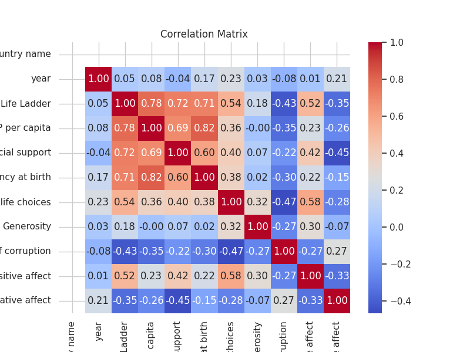

# Automated Data Analysis Report

## Dataset Overview
- Shape: (2358, 11)
- Columns: ['Country name', 'year', 'Life Ladder', 'Log GDP per capita', 'Social support', 'Healthy life expectancy at birth', 'Freedom to make life choices', 'Generosity', 'Perceptions of corruption', 'Positive affect', 'Negative affect']
- Missing Values: {'Country name': 2358, 'year': 0, 'Life Ladder': 0, 'Log GDP per capita': 28, 'Social support': 8, 'Healthy life expectancy at birth': 63, 'Freedom to make life choices': 31, 'Generosity': 76, 'Perceptions of corruption': 120, 'Positive affect': 19, 'Negative affect': 11}

## Narrative
### Dataset Overview

The dataset contains information from 2358 observations with 11 attributes relating to various countries over a span of years, focusing primarily on well-being and quality of life indicators. The columns include basic identifiers such as 'Country name' and 'year', alongside metrics that measure life satisfaction, economic conditions, social support systems, health outcomes, and perceptions of freedom and corruption.

#### Key Attributes and Their Meanings
- **Life Ladder**: A subjective measure of well-being, indicating overall life satisfaction on a scale.
- **Log GDP per capita**: A logarithmic transformation of GDP per capita, which reflects economic prosperity.
- **Social support**: A metric indicating the perceived support individuals feel they can rely on in times of need.
- **Healthy life expectancy at birth**: The average number of years a newborn is expected to live in good health.
- **Freedom to make life choices**: Reflects the degree of autonomy individuals feel they have in making their life choices.
- **Generosity**: A measure of aid provided to others, including charitable contributions.
- **Perceptions of corruption**: Indicates the perceived level of corruption within a country’s institutions.
- **Positive and Negative affect**: Metrics that reflect emotional well-being, with positive affect denoting the experience of positive emotions, while negative affect indicates the experience of negative emotions.

### Data Quality Issues
The dataset exhibits several data quality issues, particularly concerning missing values:
- **Country name** contains no valid entries (effectively renders it unusable).
- **Log GDP per capita** has 28 missing values.
- **Social support**, **Healthy life expectancy at birth**, **Freedom to make life choices**, **Generosity**, **Perceptions of corruption**, **Positive affect**, and **Negative affect** also report varying degrees of missing data, ranging from 8 to 120 missing entries.

### Summary Statistics
The statistics indicate a general trend towards moderate life satisfaction ('Life Ladder' mean is approximately 5.48) and varying degrees of economic success (Log GDP per capita mean of approximately 9.40). The average social support score is high (0.81), indicative of strong communal ties, while perceptions of corruption (mean of 0.74) suggest moderate distrust in public institutions. Positive and negative affects show a slightly higher tendency towards positive emotional experiences.

### Insights
1. **Strong Social Support**: The high score in social support suggests that individuals in the surveyed countries generally feel secure in their social networks.
2. **Moderate Economic Conditions**: With a mean log GDP per capita of 9.40, it signals a reasonable standard of living; however, further analysis could explore the distribution and inequality within this measure.
3. **Corruption Concerns**: Given the perceptions of corruption are not low, this could influence citizen satisfaction and trust, ultimately impacting social cohesion.
4. **Areas of Emotional Well-being**: The positive affect means slightly outweighs negative affect, suggesting that across these countries, individuals experience more positive emotional states than negative ones.

### Recommendations for Action
1. **Address Missing Data**: Urgent attention should be given to the missing values across essential metrics, especially 'Log GDP per capita' and 'Generosity.' Imputation methods or data gathering initiatives can enhance data quality.
2. **Detailed Country Analysis**: A country-level analysis could yield insights into specific regions needing intervention, particularly concerning economic measures and perceptions of corruption.
3. **Correlation Studies**: Investigate correlations between social support, well-being, and economic indicators to inform policies. Understanding these relationships could play a key role in amplifying the positive outcomes reflected in the data.
4. **Policy Initiatives for Corruption Reduction**: Given the concerns about corruption, initiatives aimed at increasing transparency and accountability could help improve overall well-being, foster trust in institutions, and subsequently enhance life satisfaction metrics.

In conclusion, this dataset provides valuable insights into the socio-economic landscape of the countries recorded, highlighting both strengths in social structures and potential areas that require immediate attention.
## Visualizations

